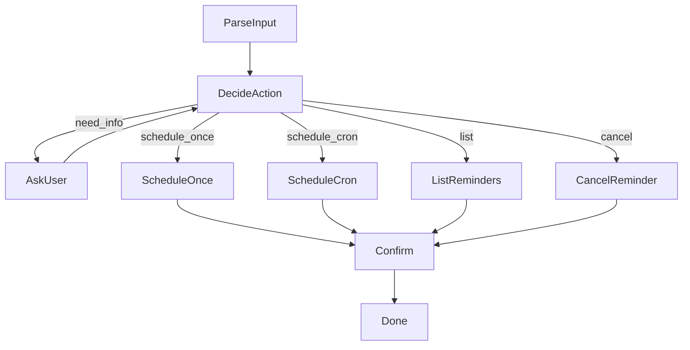

# Design Doc: Reminder Agent

> Notes for AI: Follow this design strictly. Ask human for clarification if needed.

## Requirements

User wants a **Telegram bot** that schedules reminders via natural language.

**User stories:**
1. "Remind me to call mom tomorrow at 3pm" → one-time schedule
2. "Remind me to take medicine every day at 9am" → cron schedule
3. "Remind me about the meeting" → agent asks: "When should I remind you?"

**Core behaviors:**
- Parse natural language to extract: what, when, one-time vs recurring
- If info missing → ask user for clarification
- One-time → use `schedule_once` tool (datetime + timezone)
- Recurring → use `schedule_cron` tool (cron expression)
- DeepSeek generates cron syntax from natural language

**Constraints:**
- Default timezone: UTC (can be overridden)
- Scheduler: APScheduler
- Storage: file-based (JSON) for persistence

## Flow Design

### Applicable Design Pattern:
**Agent pattern** with tool-calling loop + human-in-the-loop for clarification.

### Flow high-level Design:



1. **ParseInput**: Receive user message, extract initial context
2. **DecideAction**: LLM analyzes input, decides: need_info | schedule_once | schedule_cron | list | cancel
3. **AskUser**: Request missing information from user
4. **ScheduleOnce**: Create one-time reminder with datetime
5. **ScheduleCron**: Create recurring reminder with cron expression
6. **ListReminders**: Retrieve and format user's active reminders
7. **CancelReminder**: Remove a specific reminder
8. **Confirm**: Send confirmation/response message to user

## Utility Functions

> Notes for AI: Reuse existing utilities where possible.

1. **call_llm_with_tools** (`src/utlis/call_llm.py`)
   - *Input*: messages, tools
   - *Output*: ChatCompletionMessage with tool_calls
   - Used by DecideAction for tool selection

2. **scheduler** (`src/agents/reminder-agent/utils/scheduler.py`) — NEW
   - *Functions*:
     - `schedule_once(job_id, run_date, callback, **kwargs)` → schedules one-time job
     - `schedule_cron(job_id, cron_expr, callback, **kwargs)` → schedules recurring job
     - `remove_job(job_id)` → removes scheduled job
     - `list_jobs()` → returns all scheduled jobs
     - `init_scheduler()` → initialize APScheduler with file store
   - *Persistence*: SQLite jobstore for APScheduler

3. **storage** (`src/agents/reminder-agent/utils/storage.py`) — NEW
   - *Functions*:
     - `save_reminder(reminder_data)` → persist reminder metadata
     - `get_reminders(user_id)` → get user's reminders
     - `delete_reminder(job_id)` → remove reminder
   - *Storage*: JSON file

## Tools (LLM Function Calling)

```python
TOOLS = [
    {
        "type": "function",
        "function": {
            "name": "schedule_once",
            "description": "Schedule a one-time reminder at a specific date and time",
            "parameters": {
                "type": "object",
                "properties": {
                    "reminder_text": {
                        "type": "string",
                        "description": "What to remind the user about"
                    },
                    "datetime_iso": {
                        "type": "string",
                        "description": "ISO 8601 datetime string (e.g., '2026-01-28T15:00:00')"
                    },
                    "timezone": {
                        "type": "string",
                        "description": "IANA timezone (e.g., 'UTC', 'Europe/London'). Default: UTC"
                    }
                },
                "required": ["reminder_text", "datetime_iso"]
            }
        }
    },
    {
        "type": "function",
        "function": {
            "name": "schedule_cron",
            "description": "Schedule a recurring reminder using cron syntax",
            "parameters": {
                "type": "object",
                "properties": {
                    "reminder_text": {
                        "type": "string",
                        "description": "What to remind the user about"
                    },
                    "cron_expression": {
                        "type": "string",
                        "description": "5-field cron expression (minute hour day month weekday). Example: '0 9 * * *' for daily at 9am"
                    },
                    "timezone": {
                        "type": "string",
                        "description": "IANA timezone. Default: UTC"
                    }
                },
                "required": ["reminder_text", "cron_expression"]
            }
        }
    },
    {
        "type": "function",
        "function": {
            "name": "list_reminders",
            "description": "List all active reminders for the user",
            "parameters": {
                "type": "object",
                "properties": {},
                "required": []
            }
        }
    },
    {
        "type": "function",
        "function": {
            "name": "cancel_reminder",
            "description": "Cancel/delete a specific reminder by its ID",
            "parameters": {
                "type": "object",
                "properties": {
                    "reminder_id": {
                        "type": "string",
                        "description": "The ID of the reminder to cancel"
                    }
                },
                "required": ["reminder_id"]
            }
        }
    },
    {
        "type": "function",
        "function": {
            "name": "ask_user",
            "description": "Ask the user for missing information needed to schedule the reminder",
            "parameters": {
                "type": "object",
                "properties": {
                    "question": {
                        "type": "string",
                        "description": "The question to ask the user"
                    }
                },
                "required": ["question"]
            }
        }
    }
]
```

## Node Design

### Shared Store

```python
shared = {
    "user_id": str,              # Telegram user ID
    "chat_id": str,              # Telegram chat ID  
    "original_message": str,     # User's original input
    "conversation": list,        # Message history for context
    "reminder": {                # Populated after scheduling
        "job_id": str,
        "text": str,
        "schedule_type": "once" | "cron",
        "schedule_value": str,   # ISO datetime or cron expr
        "timezone": str
    },
    "response": str              # Final response to user
}
```

### Node Steps

1. **ParseInput**
   - *Purpose*: Initialize shared store from incoming message
   - *Type*: Regular Node
   - *Steps*:
     - *prep*: Read incoming message data
     - *exec*: Extract user_id, chat_id, message text
     - *post*: Write to shared store, return "default"

2. **DecideAction**
   - *Purpose*: LLM decides what to do (ask, schedule_once, schedule_cron)
   - *Type*: Regular Node with retry (max_retries=3)
   - *Steps*:
     - *prep*: Read original_message and conversation from shared
     - *exec*: Call LLM with tools, get tool selection
     - *post*: Route based on tool called:
       - "ask_user" → return "need_info"
       - "schedule_once" → store params, return "schedule_once"
       - "schedule_cron" → store params, return "schedule_cron"

3. **AskUser**
   - *Purpose*: Send question to user, wait for response
   - *Type*: Regular Node
   - *Steps*:
     - *prep*: Read question from shared
     - *exec*: Return question (actual send handled by Telegram bot)
     - *post*: Append Q&A to conversation, return "decide" to loop back

4. **ScheduleOnce**
   - *Purpose*: Create one-time reminder in APScheduler
   - *Type*: Regular Node
   - *Steps*:
     - *prep*: Read reminder params (text, datetime, timezone)
     - *exec*: Call scheduler.schedule_once()
     - *post*: Store job_id in shared, return "confirm"

5. **ScheduleCron**
   - *Purpose*: Create recurring reminder in APScheduler
   - *Type*: Regular Node
   - *Steps*:
     - *prep*: Read reminder params (text, cron_expr, timezone)
     - *exec*: Call scheduler.schedule_cron()
     - *post*: Store job_id in shared, return "confirm"

6. **Confirm**
   - *Purpose*: Generate confirmation message
   - *Type*: Regular Node
   - *Steps*:
     - *prep*: Read reminder details from shared
     - *exec*: Format confirmation message
     - *post*: Store response in shared, return "done"

## File Structure

```
src/agents/reminder-agent/
├── main.py           # Entry point (Telegram bot integration)
├── nodes.py          # All node definitions
├── flow.py           # Flow creation
├── tools.py          # Tool definitions for LLM
├── utils/
│   ├── __init__.py
│   ├── scheduler.py  # APScheduler wrapper
│   └── storage.py    # Reminder persistence
├── data/
│   └── reminders.json
└── docs/
    └── design.md     # This file
```

## Implementation Notes

- Current date for LLM: inject current datetime in system prompt
- Telegram bot: use `python-telegram-bot` (already in deps)
- For testing: can run flow standalone with mock inputs
- APScheduler: use BackgroundScheduler for non-blocking execution
